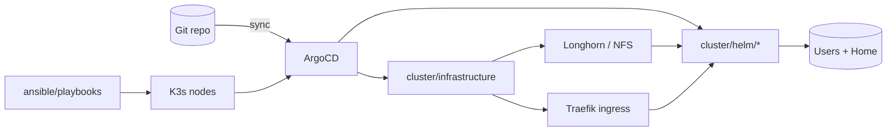
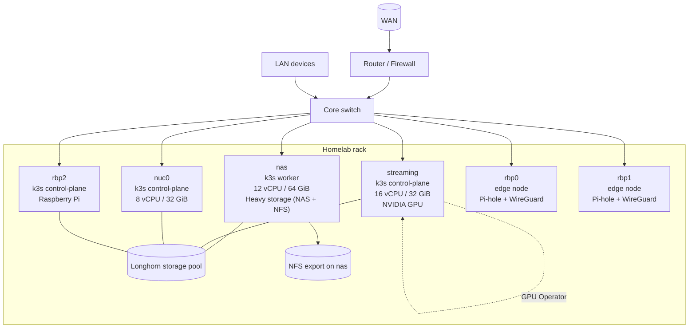

# Homelab
Kubernetes-first lab that runs my day-to-day services and doubles as a platform engineering portfolio. Everything is code-driven: GitOps for drift-free clusters, Ansible for host prep, and Helm for apps.

## Why this is interesting
- GitOps backbone: ArgoCD (`cluster/argocd/argocd-root.yaml`) keeps the cluster in sync with auto-prune/self-heal. It is private-only—no public exposure; use `kubectl port-forward svc/argocd-server -n argocd 8080:443` when you need the UI.
- Host lifecycle as code: Ansible playbooks handle users/SSH, sudo hardening, upgrades, and restic backups (`ansible/playbooks/*.yaml`).
- Platform building blocks: Traefik ingress, storage classes, and base services live in `cluster/infrastructure/`; monitoring lives under `cluster/helm/monitoring`.
- App catalog: One Helm folder per stack (`cluster/helm/*`) spanning identity (authentik), automation (n8n, renovate), data (databases, syncthing), media, community, and hobby services.
- Safety rails: Ad-hoc manifests and a smoke-test deployment at `kubectl/test-pod/TestDeployment.yaml` for quick PVC/ingress checks.

## Architecture at a glance


## Hardware topology


## Repository map
- `ansible/` — Makefile-driven playbooks: `setup-node.yaml`, `upgrade-all.yaml`, `backup-setup.yaml`, plus `restic_env.yaml.dist`.
- `cluster/argocd/` — Root ArgoCD Application and project definitions for GitOps.
- `cluster/infrastructure/` — Base cluster services (Traefik, storage classes, system controllers).
- `cluster/helm/` — App-specific Helm values; iterate locally with `helm template <chart-dir> --values values.yaml`.
- `kubectl/` — Standalone manifests (GPU operator values, ingress routes, smoke-test pod).

## Quick actions
- ▶️ Port-forward ArgoCD UI (private-only by design): `kubectl port-forward svc/argocd-server -n argocd 8080:443`
- 🛠️ Render a chart locally (run inside its folder): `helm lint && helm template . --values values.yaml`
- 🚀 Smoke-test PVC/ingress: `kubectl --context <cluster> apply --dry-run=server -f kubectl/test-pod/TestDeployment.yaml`
- 🔧 Prep hosts: `cd ansible && make init && make setup-node`
- 💾 Configure backups: `cd ansible && make backup-setup` (fill `restic_env.yaml.dist` first)

## Bootstrap runbook
1) Pull submodules (vendorized charts live here):
```bash
git submodule update --init --recursive
```
2) Prep nodes with Ansible:
```bash
cd ansible
make init           # install required collections
make setup-node     # bootstrap users, packages, SSH keys (prompts for SSH password)
make upgrade-all    # apply OS updates across the fleet
make backup-setup   # configure restic (fill restic_env.yaml.dist first)
```
3) Seed GitOps once ArgoCD is installed in-cluster:
```bash
kubectl apply -n argocd -f cluster/argocd/argocd-root.yaml
```
The root app tracks the `develop` branch and syncs every app directory in `cluster/helm/` plus infrastructure.
4) Validate charts and manifests before commits:
```bash
helm lint && helm template . --values values.yaml   # run inside a chart directory
kubectl apply --dry-run=client -f <file>            # for raw manifests
```
5) Smoke-test cluster connectivity and storage:
```bash
kubectl --context <cluster> apply --dry-run=server -f kubectl/test-pod/TestDeployment.yaml
```

## Copying or adapting this repo
- Secrets are intentionally absent; supply your own vault/external secret store. `restic_env.yaml.dist` is a template only.
- Update `cluster/argocd/argocd-root.yaml` with your `repoURL` and `targetRevision` before applying.
- Storage/ingress assumptions come from `cluster/infrastructure/` (Traefik, Longhorn/NFS); adjust if you use other providers.
- Keep YAML two-space indented with lowercase keys. Drive changes through GitOps instead of ad-hoc kubectl edits to keep drift visible.

## Current homelab snapshot
- Nodes: `nas` (12 vCPU, ~64 GiB RAM, Intel iGPU) and `streaming` (16 vCPU, ~32 GiB RAM, NVIDIA GPU via GPU Operator); both on k3s v1.30 with containerd and Longhorn CSI.
- Namespaces in use: `argocd`, `authentik`, `databases`, `monitoring`, `media-stack`, `minecraft`, `discourse`, `n8n`, `renovate`, `syncthing`, `ghostfolio`, `firefly`, `guacamole`, `wiki`, plus infra/system spaces (`longhorn-system`, `gpu-operator`, `node-feature-discovery`, etc.).
- Core add-ons: Traefik ingress, Longhorn storage, NVIDIA GPU Operator, Node Feature Discovery, system-upgrade-controller.
- Typical workloads: Plex and companions (`media-stack`), automation (`n8n`, `renovate`), finance (`firefly`, `ghostfolio`), identity (`authentik`), comms (`thelounge`, `synapse`, `discourse`), dashboards (`dashy`), and hobby services (`minecraft`, `wiki`).
